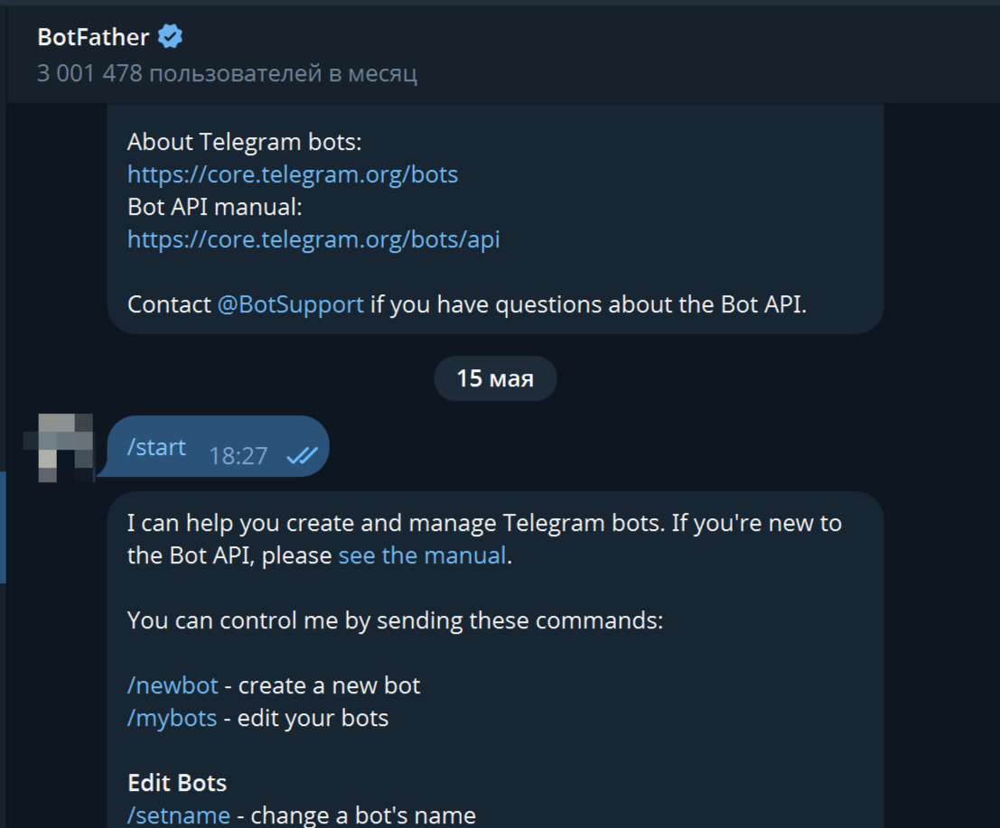
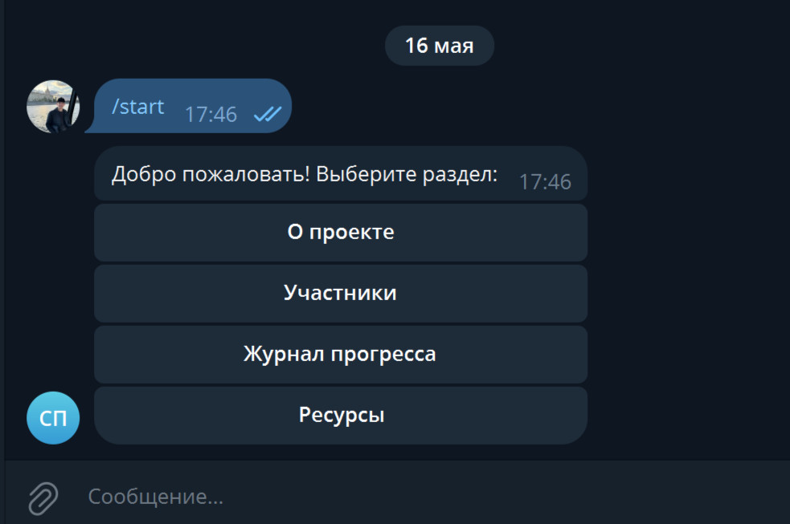
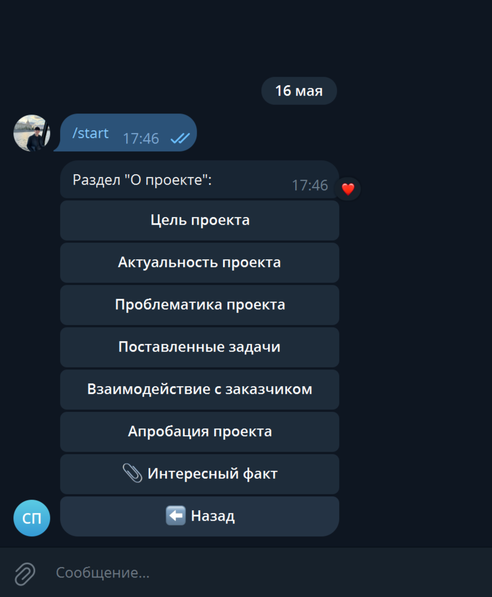
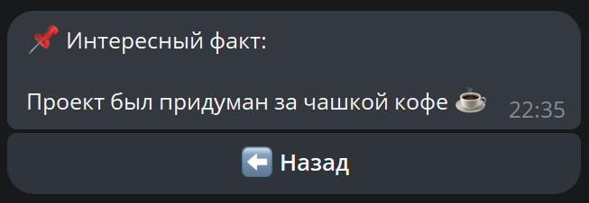

# Документация Telegram-бота для проектной практики на Node_JS

Целью данной проектной практики являлось разработать Telegram-бота, который будет служить инструментом для демонстрации результатов деятельности студентской команды по модернизации цифровой инфраструктуры проектной деятельности Московского Политехнического университета.
Работа была выполнена на языке программирования JavaScript, используя Node.js и библиотеку telegraf для взаимодействия с Telegram Bot API.

**Бот должен:**

- Представлять ключевые идеи и цели проекта.
- Обеспечивать удобное взаимодействие с пользователем через меню.
- Содержать информацию о участниках, этапах работы, ресурсах и задачах.
- Иметь возможность возвращаться к предыдущим разделам (навигация).

---

## 1. Исследование предметной области

Первым шагом необходимо провести аналитику для постановки цели и определения функционала.

### 1.1 Цель

**Цель создания бота:** Создание Telegram-бота как инструмента презентации результатов проектной деятельности , позволяющего пользователям быстро получить доступ к информации о проекте, его целях, участниках, этапах реализации и ресурсах.

Ознакомиться с официальной документацией, чтобы понять доступные методы:

- **Telegram Bot API**: https://core.telegram.org/bots/api
- **JavaScript (MDN)**: https://developer.mozilla.org/ru/docs/Web/JavaScript
- **node-telegram-bot-api (GitHub)**: https://github.com/yagop/node-telegram-bot-api

### 1.2 Задачи

**Задачи бота:**

- 1. Реализовать главное меню с разделами: "О проекте", "Участники", "Журнал прогресса", "Ресурсы".
- 2. Обеспечить удобную навигацию между разделами (включая кнопки "Назад").-.- 3. Отображать структурированную информацию с возможностью выбора подменю.
- 4. Поддерживать обратную связь с пользователями через callback-запросы.
- 5. Генерировать ссылки на внешние ресурсы (прототипы, сайты).

Проанализировать похожих ботов:

- Протестируйте их команды и сцены.
- Зафиксируйте удобные решения и оформления.

### 1.3 Технологии и инструменты

- **Node.js** - Среда выполнения JavaScript
- **npm** - Пакетный менеджер
- **Telegraf** - Библиотека для работы с Telegram Bot API
- **dotenv** - Модуль для загрузки переменных окружения
- **VS Code** - Редактор кода

---

## 2. Подготовка и конфигурация окружения

Для работы потребуется **Node.js (≥14)** и **npm**.

### 2.1. Установка Node.js

#### 2.1.1 Перейдите на официальный сайт Node.js

Откройте браузер и перейдите по ссылке: 🔗 https://nodejs.org
На сайте вы увидите две версии:

1. LTS (Long Term Support) – стабильная и рекомендуемая для большинства пользователей.
2. Current – последняя, но менее стабильная версия.
   Выберите LTS , если вы новичок или работаете над проектом, требующим стабильности.

#### 2.1.2 Скачайте установочный файл

Сайт автоматически определит вашу операционную систему и предложит соответствующий установщик:

- Windows: .msi или .exe
- macOS: .pkg
- Linux: с помощью терминала (например, apt, yum, snap, nvm)
  Нажмите **"Download"** и запустите установку.

#### 2.1.3 Запустите установку

На Windows/макOS: Дважды щёлкните скачанный установочный файл и следуйте инструкциям мастера установки.
На Linux: Выполните команду в терминале (пример):

```bash
sudo apt update && sudo apt install nodejs npm
```

или через nvm:

```bash
curl -o- https://raw.githubusercontent.com/nvm-sh/nvm/v0.39.7/install.sh  | bash
source ~/.bashrc
nvm install --lts
```

### 2.2 Проверка установленного Node.js

После установки важно проверить, что всё установлено корректно.
Откройте терминал (или командную строку) и выполните:

```bash
node -v   #Вы должны увидеть что-то подобное: v18.17.1
npm -v
```

### 2.3 Почему важно использовать .env

- Хранение конфиденциальной информации
- Упрощение настройки проекта
- Защита от случайной публикации секретов

### 2.4 Локальный запуск бота

```bash
node index.js
```

### 2.5 Создание проекта

1. Создайте папку проекта и перейдите в нее

```bash
mkdir src && cd src
```

2. Выполните инициализацию проекта

```bash
npm init -y
```

3. Установите зависимости

```bash
npm install node-telegram-bot-api dotenv telegraf
```

4. Создайте файл .env, в котором хранится токен бота:

```env
BOT_TOKEN=YOUR_TELEGRAM_BOT_TOKEN
```

### 2.6 Архитектура и структура проекта

```
├── handlers/
│   └── navigationHandler.js # Обработчик callback-запросов
│
├── keyboard/
│   ├── aboutMenu.js         # Клавиатура подменю "О проекте"
│   └── mainMenu.js          # Главное меню
│
├── bot.js                   # Основной файл бота
├── .env                     # Переменные окружения
└── package.json             # Конфигурационный файл npm
```

---

## 3. Регистрация бота в Telegram через BotFather



1. Откройте Telegram и найдите **@BotFather**.
2. Нажмите "Старт".
3. Отправьте `/newbot`.
4. Придумайте имя и username.
5. Получите токен и вставьте в `.env`.

---

## 4 . Реализация бота

### 4.1 Создание экземпляра бота

```js
import { Telegraf } from 'telegraf'
const bot = new Telegraf(process.env.BOT_TOKEN)
```

Используйте класс Telegraf из библиотеки telegraf. Токен передается из файла .env

### 4.2 Обработка команды /start



```js
bot.start(ctx => {
	ctx.reply('Добро пожаловать! Выберите раздел:', mainMenu())
})
```

### 4.3 Обработка callback-запросов



```js
bot.on('callback_query', navigationHandler)
```

Функция navigationHandler обрабатывает нажатия на inline-кнопки, изменяет текст сообщения и отображает новое меню или информацию.

```js
case 'about.goal':
  await ctx.editMessageText('Цель проекта...', { reply_markup: { ... } })
```

### 4.4 Главное меню

Формирует главное меню как инлайн-клавиатуру:

```js
import { Markup } from 'telegraf'

export default function mainMenu() {
	return Markup.inlineKeyboard([
		[Markup.button.callback('О проекте', 'about')],
		[Markup.button.callback('Участники', 'participants')],
		[Markup.button.callback('Журнал прогресса', 'progress')],
		[Markup.button.callback('Ресурсы', 'resources')],
	])
}
```

Позволяет пользователю выбрать один из четырех основных разделов.

### 4.5 Подменю "О проекте"

Позволяет пользователям просматривать информацию по отдельным аспектам проекта.

```js
export default function aboutMenu() {
	return Markup.inlineKeyboard([
		[Markup.button.callback('Цель проекта', 'about.goal')],
		[Markup.button.callback('Актуальность проекта', 'about.relevance')],
		[Markup.button.callback('Проблематика проекта', 'about.problem')],
		[Markup.button.callback('Поставленные задачи', 'about.tasks')],
		[Markup.button.callback('Взаимодействие с заказчиком', 'about.customer')],
		[Markup.button.callback('Апробация проекта', 'about.approval')],
		[Markup.button.callback('⬅️ Назад', 'back')],
	])
}
```

### 4.5 Обработчик действий пользователя

**Этот модуль отвечает за:**

- Переход между разделами
- Редактирование текста сообщений
- Возврат к предыдущему разделу

**Пример обработки одного пункта:**

```js
case 'about.goal':
  await ctx.editMessageText('Улучшение и модернизация цифровой инфраструктуры...', {
    reply_markup: {
      inline_keyboard: [[{ text: '⬅️ Назад', callback_data: 'about' }]],
    },
  })
  break
```

**Пример перехода в главное меню:**

```js
case 'mainMenu':
  await ctx.editMessageText('Выберите раздел:', mainMenu())
  break
```

**Пример раздела "Участники":**

```js
case 'participants':
  await ctx.editMessageText('Раздел "Участники":', {
    reply_markup: {
      inline_keyboard: [
        [{ text: 'Яковлев Артур', callback_data: 'participants.artur' }],
        [{ text: 'Обеднин Ярослав', callback_data: 'participants.yaroslav' }],
        [{ text: '⬅️ Назад', callback_data: 'mainMenu' }],
      ],
    },
  })
  break
```

**Пример раздела "Ресурсы" (включая внешние ссылки):**

```js
case 'resources':
  await ctx.editMessageText('Ресурсы:', {
    reply_markup: {
      inline_keyboard: [
        [{ text: 'Личный кабинет обучающегося', url: 'https://e.mospolytech.ru/old/index.php ' }],
        [{ text: 'Центр проектной деятельности', url: 'https://projects.mospolytech.ru/cpd_mospolytech ' }],
        [{ text: '⬅️ Назад', callback_data: 'mainMenu' }],
      ],
    },
  })
  break
```

# 5. Модификация Telegram-бота: Добавление раздела «Интересный факт»

Добавлен раздел с кнопкой «Интересный факт», при нажатии на которую пользователю будет показываться случайный интересный факт о проекте.

## 5.1 Изменения в коде:

### navigationHandler.js

В файл navigationHandler.js добавлен новый обработчик для about.fact:

```js
case 'about.fact': {
  await ctx.answerCbQuery();

  const facts = [
    'Проект вдохновлён реальными историями успеха студентов.',
    'Бот был создан за 3 дня интенсивной командной работы.',
    'Каждый раздел бота можно легко расширить новыми модулями.',
    'Интерфейс разрабатывался с учётом UX-исследований.',
    'Бот работает на Node.js с использованием Telegraf.'
  ];

  const randomFact = facts[Math.floor(Math.random() * facts.length)];

  await ctx.editMessageText(`📌 Интересный факт:\n\n${randomFact}`, {
    reply_markup: Markup.inlineKeyboard([
      [Markup.button.callback('⬅️ Назад', 'about')]
    ])
  });
  break;
}
```

### aboutMenu.js

В файл **aboutMenu.js** свою очередь тоже был добавлен обработчик для about.fact:

```js
[Markup.button.callback('📎 Интересный факт', 'about.fact')]
```

## Изменения в боте


